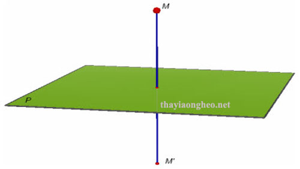

# Homework 1: Vector, Line and Plane

## Promblem 1

### Viết các vector $A, B, C, D, E, F, G, H$ trong không gian $R^n$

- $A = (a_1, a_2, \ldots, a_n)$

- $B = (b_1, b_2, \ldots, b_n)$

- $C = (c_1, c_2, \ldots, c_n)$

- $D = (d_1, d_2, \ldots, d_n)$

- $E = (e_1, e_2, \ldots, e_n)$

- $F = (f_1, f_2, \ldots, f_n)$

- $G = (g_1, g_2, \ldots, g_n)$

- $H = (h_1, h_2, \ldots, h_n)$

### Chứng minh $A + B = B + A$

- Ta có: $A+B = (a_1 + b_1, a_2 + b_2, \ldots, a_n + b_n)$

- Và: $B+A = (b_1 + a_1, b_2 + a_2, \ldots, b_n + a_n)$

- Do phép cộng trong tập số thực là giao hoán, nên ta có: $a_i + b_i = b_i + a_i$ với mọi $i = 1, 2, \ldots, n$

- Vậy ta có: $A + B = B + A$

### Chứng minh tổng của 8 vector không thay đổi khi thay đổi thứ tự các vector

- Ta có tổng của 8 vector: $S = A_1 + A_2 + A_3 + A_4 + A_5 + A_6 + A_7 + A_8$ trong đó $(A_1, A_2, A_3, A_4, A_5, A_6, A_7, A_8)$ là hoán vị của $(A, B, C, D, E, F, G, H)$

- Giả sử ta đổi chỗ hai vector bất kỳ trong tổng, ví dụ đổi chỗ $A_i$ và $A_{i+1}$, ta có:

  $\ldots + A_i + A_{i + 1} + \ldots$ thành $\ldots + A_{i + 1} + A_i + \ldots$

  Do ($A_i + A_{i + 1} = A_{i + 1} + A_i$) nên tổng không thay đổi.

- Bằng cách lặp lại quá trình này, ta có thể đổi chỗ bất kỳ hai vector nào trong tổng mà không làm thay đổi giá trị của tổng.

### Giải thích tổng hợp bằng phương pháp đại số đơn giản hơn so với phương pháp hình học (đầu-cuối).

- Với phương pháp đại số, ta chỉ cần thực hiện các phép cộng từng thành phần của các vector, điều này đơn giản và nhanh chóng hơn so với việc vẽ hình và xác định điểm đầu-cuối của các vector.

## Promblem 2

### Viết $v(t,s)$

- Ta có: $L_1(t) = (1 + t, -t, 1)$ và $L_2(s) = (2s, 1 + s, 2 + 2s)$

- Nên: $v(t, s) = L_1(t) - L_2(s) = (1 + t - 2s, -1 -t - s, -1 - 2s)$

### Viết hệ phương trình $v(t,s) . A_1 = 0$ và $v(t,s) . A_2 = 0$

- Ta có: $A_1 = (1, -1, 0)$ và $A_2 = (2, 1, 2)$

- $v(t,s) . A_1 = 0 \Longrightarrow 1 + t - 2s - (-1 - t - s) = 0 \Longrightarrow 2t - s + 2 = 0$

- $v(t,s) . A_2 = 0 \Longrightarrow 2(1 + t - 2s) + 1(-1 - t - s) + 2(-1 - 2s) = 0 \Longrightarrow t - 9s - 1 = 0$

### Tìm tọa độ của các điểm gần nhất trên $L_1$ và $L_2$

- Giải hệ phương trình, tìm được $t = \frac{-19}{17}$ và $s = \frac{-4}{17}$

- Thay $t$ vào $L_1(t)$, ta có tọa độ điểm gần nhất trên $L_1$: $L_1(\frac{-19}{17}) = (\frac{-2}{17}, \frac{19}{17}, 1)$

- Thay $s$ vào $L_2(s)$, ta có tọa độ điểm gần nhất trên $L_2$: $L_2(\frac{-4}{17}) = (\frac{-8}{17}, \frac{13}{17}, \frac{26}{17})$

### Tính khoảng cách giữa hai điểm gần nhất trên $L_1$ và $L_2$

v(t,s) tại $t = \frac{-19}{17}$ và $s = \frac{-4}{17}$ là:

$v = (\frac{6}{17}, \frac{6}{17}, \frac{-9}{17})$

Khoảng cách giữa hai điểm gần nhất trên $L_1$ và $L_2$ là:

$d = ||v|| = \sqrt{(\frac{6}{17})^2 + (\frac{6}{17})^2 + (\frac{-9}{17})^2} = \frac{\sqrt{117}}{17} = \frac{3\sqrt{17}}{17}$

### Thực hiện tương tư khi thay $P_2(0, 1, 1)$

## Promblem 3

### Bình phương 2 vế của phương trình $||X - A|| = ||X - B||$

- Ta có: $||X - A||^2 = ||X - B||^2$
- Mở rộng hai vế, ta có:

  $(X - A) . (X - A) = (X - B) . (X - B)$

  $X . X - 2A . X + A . A = X . X - 2B . X + B . B$
- Rút gọn, ta được:
    $-2A . X + ||A||^2 = -2B . X + ||B||^2$
- Sắp xếp lại, ta có:
    $2(B - A) . X = ||B||^2 - ||A||^2$
    $(B - A) . X = \dfrac{1}{2}(||B||^2 - ||A||^2)$

### Xác định N và c theo A và B

- Ta có: $N = B - A$

- Và: $c = \dfrac{1}{2}(||B||^2 - ||A||^2)$

### Giải thích N

- Mặt phẳng X được gọi là mặt phẳng trung trực của đoạn thẳng AB. Vectơ pháp tuyến N chỉ hướng từ điểm A đến điểm B, và độ dài của N tương ứng với khoảng cách giữa hai điểm A và B.

