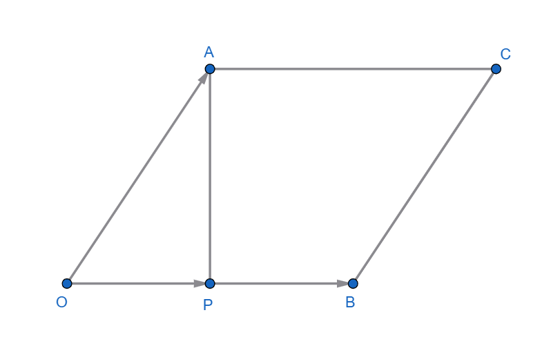
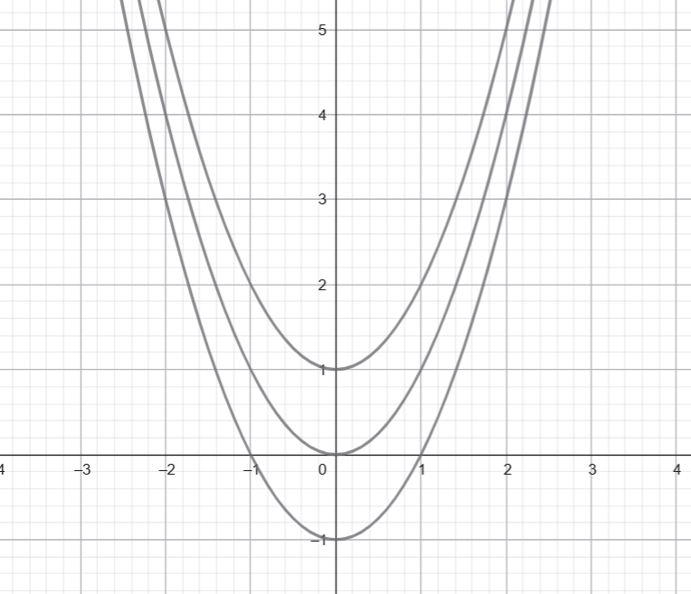

# Homework 02

## Part 3 - Conceptual Problems

### Câu 13 - Tìm tập hợp các điểm $X(x, y, z)$ cách đều hai điểm cố định $A(1, 0, 0)$ và $B(0, 2, 0)$ trong không gian. Mô tả bằng phương trình mặt phẳng và chỉ ra vectơ pháp tuyến của mặt phẳng đó.

- Ta có: 

$||X - A||^2 = ||X - B||^2 \Longrightarrow (x-1)^2 + (y-0)^2 + (z-0)^2 = (x-0)^2 + (y-2)^2 + (z-0)^2 \Longrightarrow x^2 - 2x + 1 + y^2 + z^2 = x^2 + y^2 - 4y + 4 + z^2 \Longrightarrow -2x + 1 = -4y + 4 \Longrightarrow 2x - 4y + 3 = 0$

- Vậy tập hợp các điểm $X(x, y, z)$ cách đều hai điểm cố định $A(1, 0, 0)$ và $B(0, 2, 0)$ là mặt phẳng có phương trình: $2x - 4y + 3 = 0$ và vectơ pháp tuyến của mặt phẳng đó là $\overrightarrow{n} = (2, -4, 0)$.

### Câu 14 - Viết phương trình tham số của đường thẳng đi qua điểm $P$ và có hướng là $A$. Tìm giá trị của $t$ để khoảng cách từ $O$ đến đường thẳng này là nhỏ nhất.

- Phương trình đường thẳng đi qua P và có hướng là A được viết dưới dạng tham số như sau: $X = P + tA$ với $t \in R$.

- Xét bình phương khoảng cách từ điểm $O$ đến điểm $X$ trên đường thẳng:

$d^2 = ||X - O||^2 = ||P + tA - O||^2 = ||P + tA||^2 = (P + tA) \cdot (P + tA) = P \cdot P + 2t(P \cdot A) + t^2(A \cdot A)$

- Để tìm giá trị của $t$ sao cho khoảng cách từ $O$ đến đường thẳng là nhỏ nhất, ta lấy đạo hàm theo $t$ và đặt bằng 0:

$f'(t) = 2(P \cdot A) + 2t(A \cdot A) = 0 \Longrightarrow t = -\dfrac{-2(P \cdot A)}{2(A \cdot A)} = -\dfrac{P \cdot A}{A \cdot A}$

- Vậy giá trị của $t$ để khoảng cách từ $O$ đến đường thẳng là nhỏ nhất là $t = -\dfrac{P \cdot A}{A \cdot A}$.

## Câu 15

- Diện tích hình hình $OACB$ là: $S= OB.AP$

- Trong đó: cạnh đáy $OB = ||B||$ và chiều cao $AP^2 = ||A||^2 - ||P||^2$ (Pytago)

- Thay $P = \dfrac{A \cdot B}{B }B$, ta có: $||P||^2 = \dfrac{(A \cdot B)^2}{||B||^2}$, suy ra đường cao: $AP^2 = ||A||^2 - \dfrac{(A \cdot B)^2}{||B||^2}$

- Bình phương diện tích hình $OACB$ là:
$S^2 = OB^2 . AP^2 = ||B||^2 (||A||^2 - \dfrac{(A \cdot B)^2}{||B||^2}) = ||A||^2||B||^2 - (A \cdot B)^2$ (Nhân $||B||^2$ vào trong ngoặc)

## Câu 16

- Cho $f(x,y) = y - x^2$

### Vẽ các đường cong mức của hàm số $f(x,y)$ với các giá trị mức $c = -1, 0, 1$.

- Ta có: $f(x,y) = c \Longrightarrow y - x^2 = c \Longrightarrow y = x^2 + c$

- Với $c = -1$: $y = x^2 - 1$ 

- Với $c = 0$: $y = x^2$

- Với $c = 1$: $y = x^2 + 1$

### Mô tả dạng hình học

- Các đường đều là parabol, có cùng trục đối xứng $x=0$, cùng độ cong. Khi $c$ tăng thì parabol dịch chuyển lên trên theo trục tung và ngược lại.

### Giao tuyến với mặt phẳng $z = 2$

- Ta có: $f(x,y) = z \Longrightarrow y - x^2 = 2 \Longrightarrow y = x^2 + 2$

- Đây là 1 parabol nằm trong mặt phẳng $z=2$ (cũng chính là đường định mức với $c=2$).